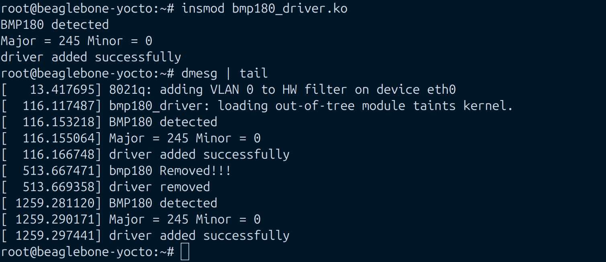
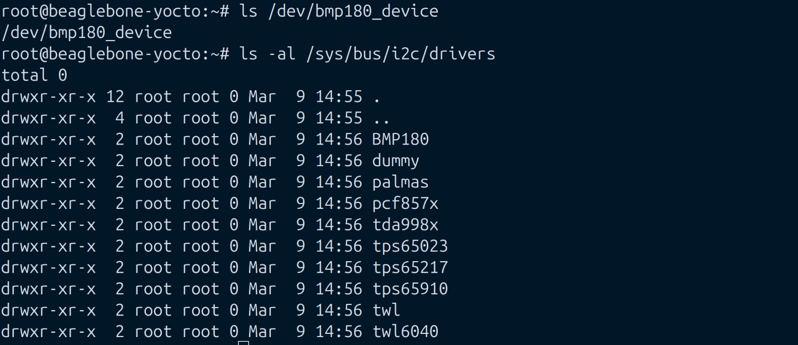
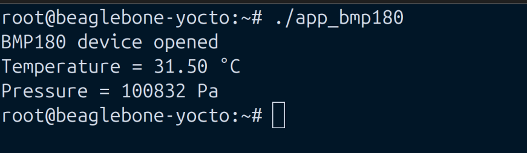

# BMP180 Linux I²C Device Driver (BeagleBone / Embedded Linux)

## Overview

This project implements a **Linux kernel device driver** for the **BMP180 barometric pressure and temperature sensor** using the **I²C subsystem**.
The driver exposes the sensor to user space through a **character device interface**, allowing applications to read raw sensor data and compute temperature and pressure.

The project demonstrates key **Embedded Linux driver development concepts**, including:

* Linux **I²C client driver**
* **Character device driver** implementation
* **User–kernel communication**
* Sensor **register programming**
* **User-space application** interacting with kernel driver

The driver was tested on a **BeagleBone running a Yocto-based Linux kernel (6.6.x)**.
## Driver Loaded



## I2C Device Detection



## User Application Output


---

## Sensor

This project interfaces with the **Bosch BMP180**.

Capabilities of the sensor:

* Barometric pressure measurement
* Temperature measurement
* Digital I²C interface
* On-chip calibration constants

---

# Project Structure

```
bmp180-linux-driver/
│
├── bmp180_driver.c        # Linux kernel I²C + character device driver
├── user_app.c             # User-space application
├── Makefile               # Kernel module build file
└── README.md
```

---

# System Architecture

```
User Application
       │
       │ read() / write()
       ▼
/dev/bmp180_device
       │
Character Device Driver
       │
Linux I²C Subsystem
       │
BMP180 Sensor
```

The driver creates the device node:

```
/dev/bmp180_device
```

User applications communicate with the sensor through standard **POSIX file operations**.

---

# Driver Features

* Detects BMP180 using **chip ID register (0xD0)**
* Communicates over **I²C bus**
* Provides **character device interface**
* Supports:

```
open()
read()
write()
close()
```

The driver performs:

* I²C read operations
* I²C write operations
* Kernel → user memory transfer using `copy_to_user`
* User → kernel memory transfer using `copy_from_user`

---

# BMP180 Measurement Sequence

## Temperature Measurement

1. Write `0x2E` to control register `0xF4`
2. Wait ~4.5 ms
3. Read registers `0xF6` and `0xF7`

## Pressure Measurement

1. Write `0x34` to control register `0xF4`
2. Wait ~7.5 ms
3. Read registers `0xF6`, `0xF7`, `0xF8`

The sensor also provides **calibration constants** stored in registers:

```
0xAA – 0xBF
```

These are used to compute compensated **temperature and pressure values**.

---

# Building the Kernel Module

On the build system:

```bash
make
```

This generates:

```
bmp180_driver.ko
```

---

# Loading the Driver

Copy the module to the target board and load it:

```bash
insmod bmp180_driver.ko
```

Verify driver initialization:

```bash
dmesg | tail
```

Expected output:

```
BMP180 detected
driver added successfully
```

---

# Device Node

After loading the driver:

```
/dev/bmp180_device
```

Check using:

```bash
ls /dev/bmp180_device
```

---

# Compiling the User Application

```bash
gcc user_app.c -o bmp180_app
```

---

# Running the Application

```bash
./bmp180_app
```

Example output:

```
BMP180 device opened
Temperature = 27.34 °C
Pressure = 100842 Pa
```

---

# I²C Verification

Before running the driver, verify the device is detected on the I²C bus:

```bash
i2cdetect -y 2
```

Expected address:

```
77
```

---

# Key Linux Kernel Concepts Demonstrated

This project demonstrates several core Linux driver development topics:

### I²C Subsystem

* `i2c_driver`
* `i2c_client`
* `i2c_adapter`
* `i2c_master_recv`
* `i2c_master_send`
* `i2c_smbus_read_byte_data`

### Character Device Driver

* `alloc_chrdev_region`
* `cdev_init`
* `cdev_add`
* `device_create`
* `class_create`

### Kernel/User Space Interface

* `copy_to_user`
* `copy_from_user`

### Kernel Module Lifecycle

* `module_init`
* `module_exit`

---

# Development Environment

Hardware:

* BeagleBone Black / AM335x

Operating System:

* Yocto Linux

Kernel:

```
Linux 6.6.x
```

---

# License

This project is released under the **GPL License**.

---

# Author

Lince Kuruvila Chacko
Embedded Linux Developer

